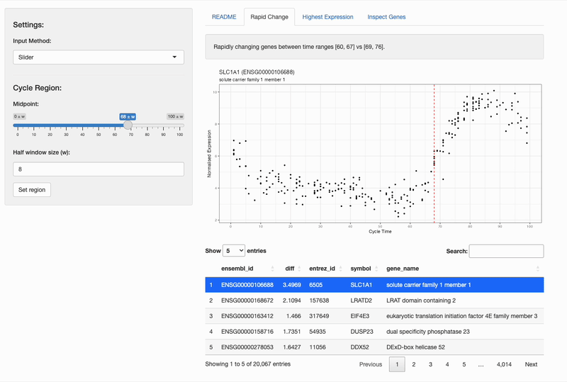

# endspect

Endspect is an app written in R Shiny for exploring gene expression changes throughout the menstrual cycle. This app uses RNA-seq data from 266 endometrial biopsy samples collected from the Royal Women's Hospital. Cycle times were estimated using the [endest](https://github.com/jessicachung/endest) R package.

# Usage

You can run the app locally by cloning the repository and running it in RStudio, or run the app on the cloud via shinyapps.io.

Alternatively, you can access the application for a limited number of hours here:  
https://jchung.shinyapps.io/endspect/
